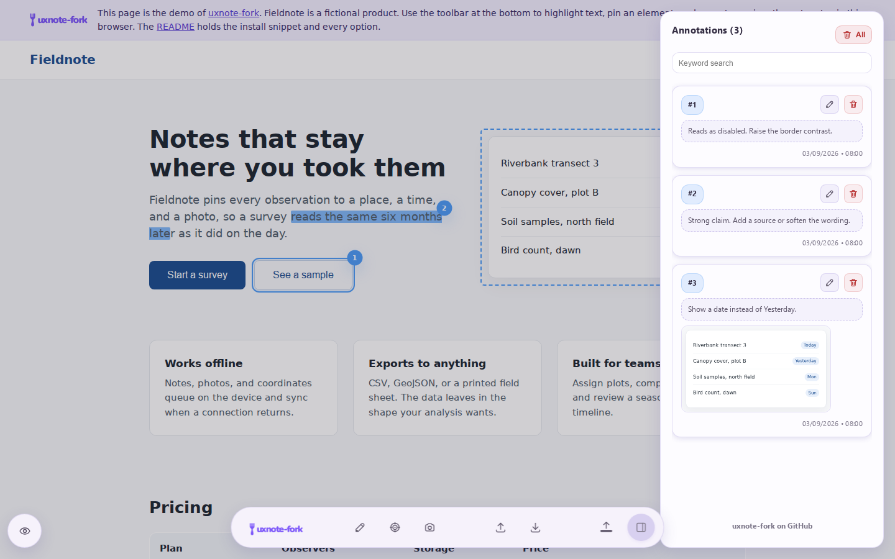
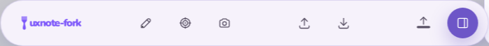
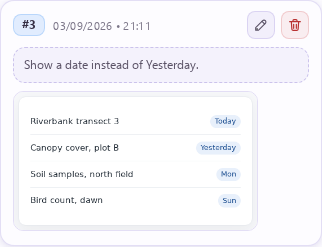
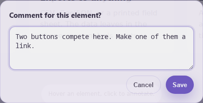
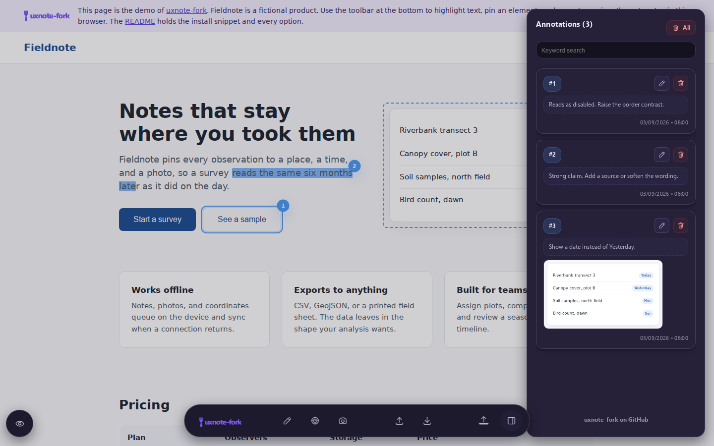

<p align="center"></p>

# uxnote-fork

A fork of [UxNote](https://github.com/ninefortyonestudio/uxnote) by
ninefortyonestudio, v1.0.0, MIT: a single-script annotation bar for mockups and
websites. One script tag on a page, and reviewers highlight text, pin elements,
frame regions, and leave numbered comments in the browser. The notes stay in
the browser, or they live on a server you name, so a client, a product team, or
a small review team reads the same set.



## Demo

<https://qu4tro.github.io/uxnote-fork/> is a demo page with the widget live on
it. The notes stay in the visitor's browser.

The page carries its own **Page theme** switch, light or dark, in the note at
the top of it. It is the page's colours alone and it never follows the system,
so the widget's own `data-theme` can be read against either background.

The page carries the widget's options in its query string, and the **Widget
settings** section below the pricing table writes it: pick a set, press Apply
and reload, and the page comes back with the widget holding it. Every option
carries a line saying what it does, and the section shows the matching script
tag to copy. Annotations already taken survive the reload.

`data-server-url` is taken only when it names a loopback address — `localhost`,
anything in 127.0.0.0/8, or `[::1]` — so a link cannot point a visitor's notes
at somebody else's server, and `data-server-api-key` travels only beside a URL
that survived. `server/server.py` is what to point them at. The hosted demo is
served over HTTPS and browsers restrict a public page reaching a loopback
address, so the pair is meant for a demo you run locally.

Locally:

```sh
npm install
npm start
```

Then open <http://localhost:4173/>.

## Features

- **Text highlights and element pins.** Select text or click an element, write
  a comment, and the page carries a numbered marker.
- **Region screenshots.** Drag a frame around part of the page and the note
  carries a picture of it. On a touch screen one press of the camera takes the
  view. Load snapdom for this.
- **Server sync.** Name a server and the annotations live on it, one set per
  site, shared by every reviewer who opens the page. The browser keeps a copy,
  so a note written while the server is down survives a reload and goes up when
  the server comes back.
- **JSON export and import.** Both are on by default, and each one switches
  off per site. A `data-mailto` address adds a mail handoff beside them.
- **A dark theme.** `auto` by default, following the system.
- **Comment-first notes.** A note is one comment. On a roomy window the card
  parks beside the toolbar; on a small screen it rises from the bottom edge.
  The panel starts closed.
- **Single-page apps.** The widget follows `pushState`, so a route change
  without a document load draws the annotations of the route you reached.
- **Fenced areas.** `data-uxnote-ignore` keeps the widget out of an area;
  `data-uxnote-allow` lets it into an element it would otherwise refuse.
- **A layout for a small screen.** Under 640px wide or 480px tall the toolbar
  carries five thumb-sized controls, and the panel, the comment prompt and the
  dialogs become bottom sheets.



## Install

One tag:

```html
<script src="https://github.com/Qu4tro/uxnote-fork/releases/download/v2.1.0/uxnote.min-v2.1.0.js"></script>
```

Two tags for the region screenshots, snapdom first:

```html
<script src="https://github.com/Qu4tro/uxnote-fork/releases/download/v2.1.0/snapdom.min.js"></script>
<script src="https://github.com/Qu4tro/uxnote-fork/releases/download/v2.1.0/uxnote.min-v2.1.0.js"></script>
```

Both files are assets of the `v2.1.0` release, and every release carries both.

The three `is*` names and the three `colorFor*` names are plain attributes; the
rest are `data-` attributes.

**The block below is a list of every attribute name, not a snippet to copy.**
It puts each name and the shape of its value in one place. Copied whole it
points the widget at a server on `http://localhost:8123` with the key
`review-key` and mails to `team@example.com`, none of which exist. Take the
lines you want.

```html
<!-- Every attribute name, with a value that shows its shape. A reference,
     not a starting point. -->
<script src="https://github.com/Qu4tro/uxnote-fork/releases/download/v2.1.0/uxnote.min-v2.1.0.js"
  colorForHighlight="#4e9cf6"
  colorForTextHighlight="#4e9cf6"
  colorForElementHighlight="#8b5cf6"
  colorForRegionHighlight="#f59f00"
  isBackdropVisible="true"
  isToolVisibleAtFirstLaunch="true"
  isToolOnTopAtLaunch="false"
  data-mailto="team@example.com"
  data-json-export="true"
  data-json-import="true"
  data-server-url="http://localhost:8123"
  data-server-api-key="review-key"
  data-theme="auto"></script>
```

### Options

| Attribute | Default | Meaning |
|---|---|---|
| `colorForHighlight` | unset | One colour for all three kinds at once. Unset, each kind keeps its own default. |
| `colorForTextHighlight` | `#4e9cf6` | The text highlight, and nothing else. It overrides `colorForHighlight` for that kind and leaves the other two where they are. |
| `colorForElementHighlight` | `#8b5cf6` | The element outline and its marker, on the same terms. |
| `colorForRegionHighlight` | `#f59f00` | The frame of a captured region, on the same terms. |
| `isBackdropVisible` | `true` on a mouse, `false` where the pointer is coarse | Dims the page behind the annotations. On a phone the bar is a strip and the page is the whole screen, so the dimmer costs contrast for nothing; naming it brings it back. |
| `isToolVisibleAtFirstLaunch` | `true` | Shows the toolbar on the first visit. |
| `isToolOnTopAtLaunch` | `false` | Starts the toolbar at the top instead of the bottom. The control that moves it afterwards is on a wide window only, so on a small screen this is the way to ask for the top. |
| `data-mailto` | empty | The recipient of the mail handoff, and the switch for it: an address here puts the mail button in the toolbar, and nothing here means no button. Anything that is not an address counts as nothing. `data-email` and `data-to` are read the same way. The button is on a wide window only. |
| `data-json-export` | `true` | `false` removes the export control. The export writes every annotation of the site and asks nothing first. The control is in the toolbar on a wide window and in the panel head on a small screen. |
| `data-json-import` | `true` | `false` removes the import button, its dialog, and its list of imported files. The button is on a wide window only; an annotation imported earlier is drawn either way. |
| `data-server-url` | unset | The base URL of the server that stores the annotations. Unset means `localStorage`. |
| `data-server-api-key` | empty | Sent as `X-Uxnote-Key` on every request. Empty sends no header. |
| `data-theme` | `auto` | `auto` follows the system theme and changes with it, `reverse-auto` takes the other side of it, and `light` and `dark` hold one. |

**Write the word on an option that takes `true` or `false`.** Those options
read `true`, `1`, `yes` and `on`, and `false`, `0`, `no` and `off`, in any
case. Anything else falls back to the default, and an attribute written with
no value at all carries the empty string — so `data-json-export`,
`data-json-export=""` and `data-json-export="nope"` all leave the export
switched on. Switching one off is `data-json-export="false"`.

The page has a say too. The widget does not annotate inside a `<dialog>`, an
element with `popover`, or an element with `role="dialog"`, `role="menu"`,
`role="tooltip"`, or `aria-modal="true"`, and it says so with a toast.
`data-uxnote-allow` on such an element lets the widget in.
`data-uxnote-ignore` on any element keeps the widget out of it and of
everything it contains.

## Storage and the server

With no server named, the annotations sit in `localStorage`: one set per
origin, drawn on the page that carries them.

Name a server and that server is the shared store, and the browser keeps a copy
beside it. The widget draws the copy at once, reads the set from the server at
load and on each route change, settles the two, and sends one request per
annotation written, edited, or deleted. Last write wins, per annotation. **A
note written while the server is down survives a reload**, and the widget says
the request failed with a toast at the moment it does.

The widget asks the server whether it is there at load and every five minutes
after, backing off from ten seconds while it is not. A server that comes back
therefore finds the notes it missed without anybody reloading the page or
writing another one.

Two reviewers on one page settle per note. A note you did not touch takes the
server's copy; a note you wrote or edited while the server was away is yours
and goes up; a note another reviewer deleted goes. `PROTOCOL.md` has the
table.

**A dot beside the wordmark carries the answer to the last request**, so the
state of the server is on the screen rather than in a toast that has gone. It
is drawn only on a page that names a server, and it has three states, each
with its own line on hover:

| Dot | Meaning |
|---|---|
| Green | The last request was answered and the notes are on the server. |
| Yellow | The address answered, but not as this API: a refused key, or something else serving that path. |
| Red | Nothing answered. The server is down, the address is wrong, or the browser refused to reach it. Notes are kept in this browser meanwhile. |

**The api key is public.** It sits in the source of every page that carries the
script tag, so anybody who can read the page can read the key. It stops a
passer-by from writing to a review server. It is not access control. Put the
server behind a network boundary if the notes matter.

**Import writes to the shared set.** An import sends every imported annotation
to the server, and "remove" on an imported file deletes those annotations from
the server, for every reviewer. The list of imported files lives in the
importing browser alone. An annotation imported earlier stays in the store
while the import is off; only the dialog that lists the files is gone.

`PROTOCOL.md` holds the contract: six routes, an optional health probe, and one
JSON shape. Any stack can implement it. `server/server.py` does, in the Python
3.9 standard library, and it serves the repository too, so the page under review
runs on the same origin:

```sh
python3 server/server.py --port 8123 --root . --api-key review-key
```

Then open <http://localhost:8123/server/demo.html> and annotate it. The
annotations land in `uxnote-data/`.

## Region screenshots

A note can be a picture of a region of the page. Load
[snapdom](https://github.com/zumerlab/snapdom) before the widget, on the same
page, and the toolbar offers a camera beside the two other capture modes.

With a mouse, press the camera and drag to frame a region. Release the button
and the comment prompt opens, the way it does for a highlight or an element.
Escape stops, and so does the `Cancel` button on the hint. Write
a comment and the region becomes an annotation: a numbered marker and a frame on
the page, a thumbnail on its card. The picture is taken while the comment is
written, from a copy of the page snapdom renders without the widget's own
interface: it carries no toolbar, no panel and no marker, and nothing on the page
moves while it is taken. There is no drag where the pointer is coarse; one press
takes the view, and **On a touch screen** below describes it.

Pressing the thumbnail opens the picture full screen. Escape closes it, and so
does the button in its corner.

With a server the picture travels to it as a PNG, and the annotation keeps the
address the server answers with. With no server the picture rides on the
annotation itself, and the JSON export carries it.

A server that does not answer does not cost you the capture. The picture stays
on the annotation, the toast says so, and the note behaves like every other
one written while the server is away: it is held and sent again. The picture
goes up as a PNG on that later attempt, before the annotation that points at
it, so nothing carries a base64 document to the server.



## On a small screen

The widget asks two questions and keeps them apart. How much room the window
has decides the layout: `(max-width: 640px)` or `(max-height: 480px)`. What
kind of pointer is driving decides the gestures and the size of what they have
to land on: `(pointer: coarse) and (hover: none)`. A phone in landscape is
wider than 640px and still a phone, and a narrow desktop window is not one.
Both are watched, so a rotation rebuilds the toolbar rather than only moving
it. What the room decides is below; what the pointer decides is in **On a touch
screen**.

**The toolbar carries five controls**, each 48px, in one row that neither
wraps nor scrolls: hide, highlight text, annotate an element, capture, notes.
Four without snapdom, which is what the camera needs. The wordmark is hidden,
and the tooltips are not drawn where nothing can hover to open them.

**Import and the top/bottom toggle are not there.** An import needs the file on
the device, and the bar belongs in thumb reach at the bottom, which leaves the
toggle no second answer. Annotations imported earlier are still drawn; only the
dialog that manages the files is gone, and `isToolOnTopAtLaunch="true"` still
puts the bar at the top.

**Export moves to the panel head**, beside delete-all. The file goes to the
share sheet where the browser offers one, and to the same download a wide
window uses where it does not. Neither asks anything first. The mail button is
on a wide window only: a `mailto:` carries the whole document in a URL, the
first long comment overruns it, and a share sheet is where a phone hands a file
over anyway.

**The panel, the comment prompt and the dialogs rise from the bottom edge.**
Each is a sheet with a drag handle that dismisses it on a drag down, a close
button of its own, and at most 85% of the viewport, clear of the toolbar. The
contents scroll inside the sheet and the page is held still underneath, then
let go when the sheet closes. The comment prompt is opaque here, where on a
wide window it is translucent until it is pointed at.

**A narrow or a short desktop window gets the sheets too**, and keeps
everything a mouse can use: the tooltips, and the outline that previews an
element before it is pinned.

## On a touch screen

Where the pointer is coarse and nothing can hover, the three capture modes take
a different gesture. Nothing about them changes on a mouse.

**Highlight.** Select the text the way the phone selects text: press and hold,
then drag the handles. The widget waits for the selection to settle rather than
reading the release, because every drag of a handle ends in one. A bar rises
above the toolbar reading `Add note`; press it and the comment prompt opens.

**Element.** The first press previews rather than commits. The element under the
finger is outlined and a bar names it, with `Wider` and `Narrower` to walk the
chain it sits in — press anywhere inside a card and climb to the card — and
`Pin here` to commit it. It is the only way to see what is about to be
annotated when there is no hover to show it.

**Camera.** One press takes the part of the page that is on the screen. The
framing gesture is the phone's own scroll: put the page where you want it, then
press. The note carries the same `rect` a dragged frame would, so the marker,
the frame and the panel behave the same either way.

Everything a finger has to land on is sized for one: the markers on the page,
the edit and delete buttons on a card, and the buttons of every dialog. Every
field is 16px, at every width, under which iOS Safari zooms the page in when
the field takes focus and does not zoom back out. The page dimmer is off unless
`isBackdropVisible` asks for it by name.

## A note is a comment

The card asks for the comment alone. On a roomy window it parks beside the
toolbar, so the area under review stays visible, and a pointer that can hover
finds it translucent until that pointer is over it. Both of those are drawn
only where a pointer can hover: without one the card would never come back, and
the page would read straight through the comment being written. Enter saves,
Shift+Enter breaks a line, Escape cancels, and a click on the page keeps the
text.

Where the layout is compact the card is a sheet on the bottom edge instead:
opaque, with a handle and a close button of its own.

The panel starts closed. The toolbar button opens it, and so does a marker on
the page or a card. On a small screen the panel is a sheet, and pressing a note
in the list closes it and carries the page to that note.

An annotation written by an earlier release keeps its `author` and its
`priority`. The widget shows neither.



## Theme

The widget follows `prefers-color-scheme` and changes with it. Hold one theme
per site with `data-theme="light"` or `data-theme="dark"`.

A site that follows the system theme leaves the widget dressed like the page it
annotates, on either setting. `data-theme="reverse-auto"` reads the same
preference and takes the other side of it, so the two stay apart however the
system is set — a contrast a fixed `light` or `dark` only gets on one of them.

The theme covers the toolbar, the panel, the cards, the dialogs, the comment
card, the capture overlay, and the toasts. The highlight colours do not change:
`colorForHighlight` and its two per-type forms choose them. The widget writes
the resolved theme on `<html>` as `data-wn-theme="light"` or
`data-wn-theme="dark"`, so a page can style its own elements to match.



## Single-page apps

The widget follows a route change made without a document load. It wraps
`history.pushState` and `history.replaceState` and listens for `popstate`.
When the path changes, it removes the markers of the page you left, draws the
markers of the page you reached, and, with a server named, reads the
annotation set from the server again. It waits 120 ms first, so the router
has drawn the page that an annotation attaches to. An annotation whose target
arrives later is drawn when the target appears.

A page is its origin plus its pathname. A change of the query string or of the
hash alone is not a route change, so a router that keeps its routes in the
hash shows every route's annotations on every route.

## Develop

```sh
npm test         # Playwright: the desktop smoke test and four phone projects
npm run build    # minified script in dist/
npm start        # the repository on http://localhost:4173/
```

`UXNOTE_TEST_PORT` moves the test server off 4173, which is what a second
checkout already listening there needs.

CI runs the syntax check, the build, and the smoke test on every pull request
and on `main`. Every pull request gets a preview of the site, and its URL is
posted as a comment. A push to `main` deploys the demo page to
<https://qu4tro.github.io/uxnote-fork/>. A `v*` tag that matches the version in
`package.json` publishes a GitHub release with the contents of `dist/`: the
minified widget, its source map, and `snapdom.min.js`.

## Project layout

- `index.html` — the demo page, and the root of the site. The smoke test and
  the README screenshots run against it.
- `uxnote-tool/` — the widget, snapdom, and snapdom's licence.
- `server/` — the reference server and its own demo page. Not published.
- `assets/` — the logo and the README screenshots.
- `scripts/` — build, serve, and site.
- `test/` — the desktop smoke test and the mobile checks.
- `PROTOCOL.md` — the server contract.
- `dist/` — build output. Not committed.

## License

MIT. Copyright ninefortyonestudio and Qu4tro; see `LICENSE`. `uxnote-fork`
forks [ninefortyonestudio/uxnote](https://github.com/ninefortyonestudio/uxnote)
v1.0.0 under that licence. `uxnote-tool/snapdom.min.js` is SnapDOM, MIT ©
Juan Martin Muda, vendored unmodified; see `uxnote-tool/LICENSE-snapdom.txt`.
